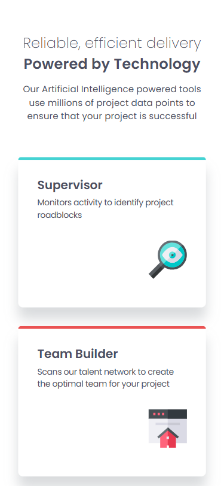
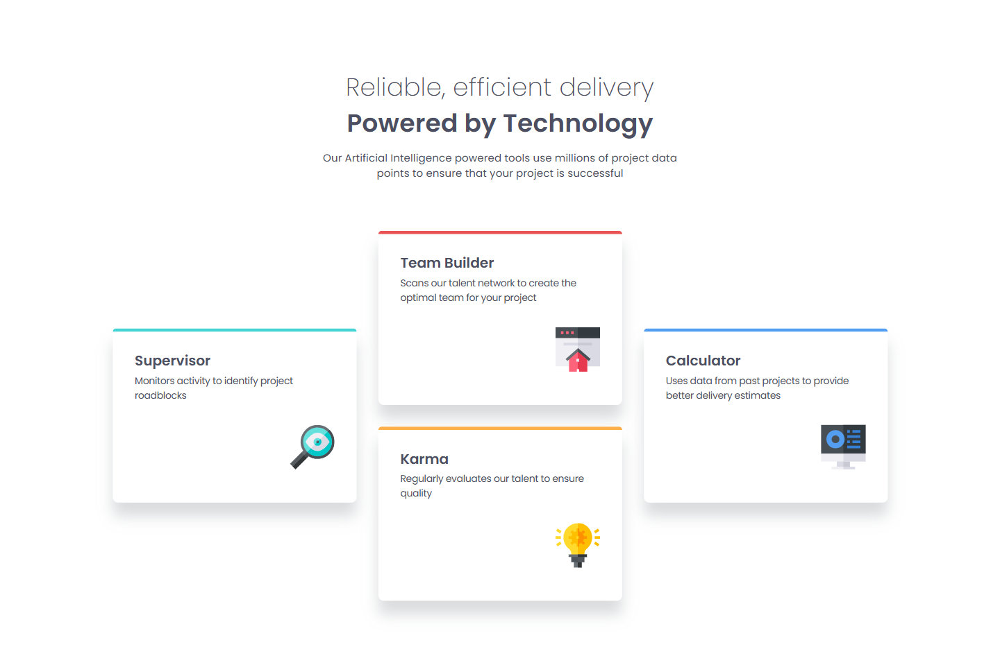
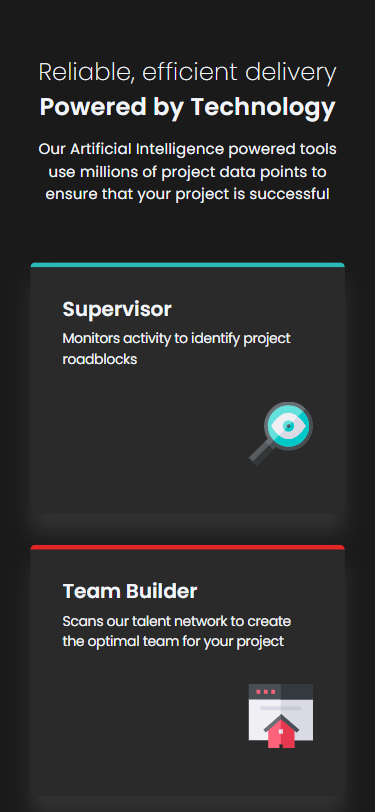
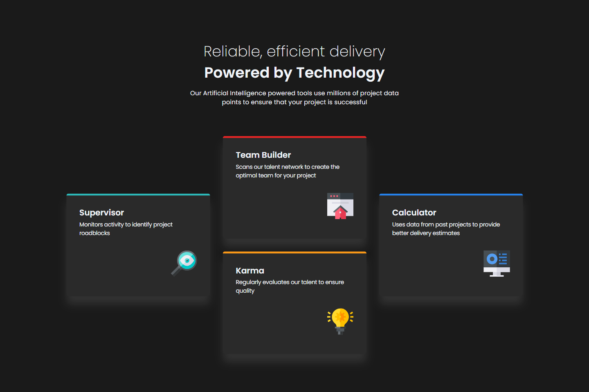

# Four-Card Feature Section

## A Clean and Responsive Four-Card Feature Section for an AI Company

| _Mobile Preview (375x812)_                            | _Desktop Preview (1440x960)_                             |
| ----------------------------------------------------- | -------------------------------------------------------- |
|       |       |
|  |  |

A clean, accessible, and responsive layout that showcases four key features of an AI-driven company.

Created as part of the building challenges from **[Frontend Mentor](https://www.frontendmentor.io/)**.

---

## Overview

This project presents a four-card layout showcasing key offerings of a fictional AI company. It features fully semantic HTML, responsive design for mobile and desktop, and thoughtful accessibility considerations.

Subtle hover transitions, dark mode support, and reduced motion preferences are integrated for a smoother and more inclusive experience. The project was coded to mirror the reference layout as closely as possible, using pixel-perfect alignment tools.

---

## Features

- Responsive 1-to-4 card layout using CSS Grid
- Mobile-first design approach
- Dark mode support using `prefers-color-scheme`
- Reduced motion compliance using `prefers-reduced-motion`
- Custom CSS variables and utility classes
- Semantic HTML5 elements
- Accessible skip link and ARIA attributes
- Clean, maintainable code with comments and structure

---

## What I Learned

- Creating semantic, accessible HTML5 structure
- Using ARIA labels and roles effectively
- Implementing dark mode with media queries and variables
- Respecting motion preferences with CSS media queries
- CSS Grid layout with `grid-template-areas`
- Utility class management (`.sr-only`, `.container`, etc.)
- How to mirror JPEG image designs in code using tools like **[PerfectPixel](https://chrome.google.com/webstore/detail/perfectpixel-by-welldonecod/dkaagdgjmgdmbnecmcefdhjekcoceebi)**

---

## Tech Used

- HTML5
- CSS3
- Git
- GitHub
- Netlify
- PerfectPixel

---

## How to Run

1. Clone the repository
2. Open `index.html` in your browser

---

## Live Demo

Or you can check out the **[live website here](https://four-card-feature-section-fm-jiro.netlify.app/)**

---

## Performance Report

A **Google Lighthouse** audit was conducted on the final version of this project. You can view the **[full report here](./lighthouse/google-lighthouse-evaluation.pdf)**.

---

## Author

Created by **Elmar Chavez**

Month/Year: **June 2025**

Journey: **3rd** month of learning _frontend web development_.
